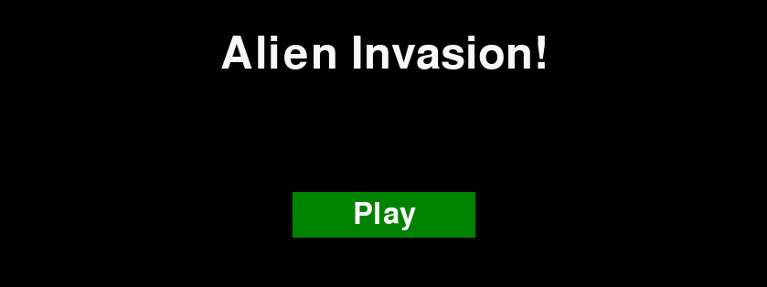
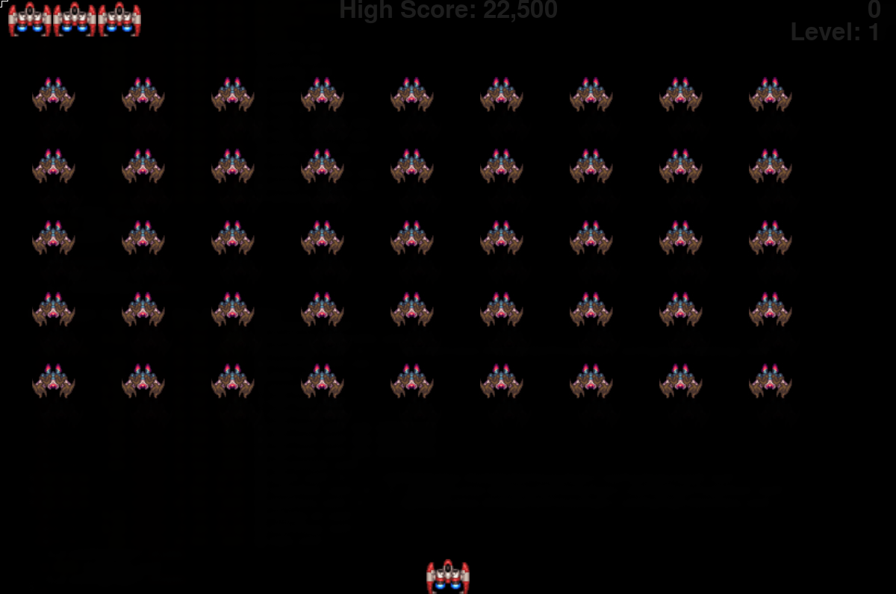

# Alien Invasion

<p align="center">
  
</p>

A classic arcade-style shooter built in Python with `pygame`. You pilot a lone ship at the bottom of the screen, a fleet of aliens advances from above, and — much like most Tuesdays — the only reasonable response is to shoot back.

This project began life as the **Alien Invasion** project from [*Python Crash Course*](https://www.oreilly.com/library/view/python-crash-course/9781457197185/part02-pro01.html) by Eric Matthes, and was then rebuilt and extended with a proper package layout, a state machine, persistent high scores, a test suite, and a few other improvements over the book version.

<p align="center">
  
</p>

## Gameplay

- Move left and right with the **arrow keys**
- Fire bullets with **space**
- Quit at any time with **q**
- Clear a fleet to level up; each level speeds the game up a notch
- Lose all three ships and you're sent back to the intro screen to try again

## Changes From The Book Version

This is not a straight copy-out of the book — the base gameplay is the same, but the project has been reworked in a handful of meaningful ways:

1. **Proper `src/`-layout Python package** with a real `pyproject.toml`, rather than a flat folder of scripts. Installable, importable, and generally better behaved.
2. **State machine instead of a boolean flag.** The book uses `game_active = True/False`; this version uses `game_state = "intro" | "playing"`, with both rendering and event handling routed through the state. Cleaner, and much easier to extend with new states later.
3. **Dedicated intro / landing screen.** A proper title screen with a centred "Alien Invasion!" header and a Play button, instead of a lone button floating over a frozen game world.
4. **Persistent high score.** The high score survives between sessions via `assets/high_score.txt`. The book version forgets everything the moment you close it, which felt a bit rude.
5. **Global `q` quit key** carved out from gameplay input, so it works from any state.
6. **Type hints throughout** — every method signature is annotated.
7. **Custom ship art** (`ship2.jpg`) and **sky-blue bullets**, in place of the book's plain grey rectangle.
8. **Tuned settings**: bullet cap raised to 10 (book uses 3), 5-row alien fleet, and adjusted speed scaling per level.
9. **A basic `pytest` suite** covering the ship, bullet, settings, game stats, and main game class. The book doesn't ship with tests; this version does.

## Project Layout

```
aliens/
├── src/aliens/
│   ├── main.py          # AlienInvasion class + main loop
│   ├── settings.py      # static and dynamic game settings
│   ├── game_stats.py    # stat tracking + high score persistence
│   ├── scoreboard.py    # HUD: score, high score, level, lives
│   ├── ship.py          # the hero ship
│   ├── bullet.py        # sky-blue projectiles of justice
│   ├── alien.py         # the fleet
│   └── button.py        # the Play button
├── tests/               # pytest suite
├── assets/              # sprites, screenshots, high_score.txt
└── pyproject.toml
```

## Installation

Requires Python 3.10+ and [`uv`](https://github.com/astral-sh/uv) (or use `pip` with a venv if you prefer the scenic route).

```bash
git clone https://github.com/Linux-Alchemy/aliens.git
cd aliens
uv sync
```

## Running The Game

```bash
uv run python -m aliens.main
```

## Running The Tests

```bash
uv run pytest
```

## Credits

Built on the foundations of the Alien Invasion project from Eric Matthes' *Python Crash Course*, then taken in its own direction. Any bugs are my own; any aliens are entirely fictional.
